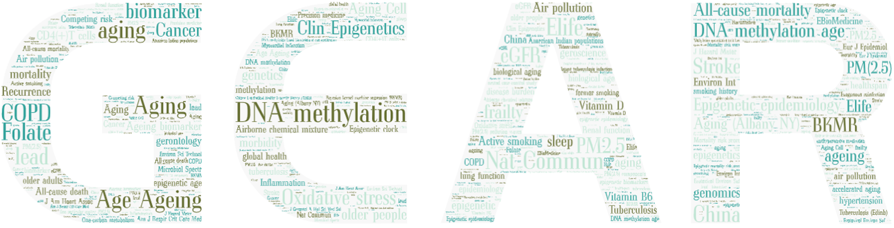

The **Gao Lab of Environmental Epidemiology & Aging Research (GEAR)**, established in 2020, is led by Dr. Xu Gao, an Assistant Professor, Associate Researcher, and Ph.D. Supervisor in the Department of Occupational and Environmental Health, School of Public Health, Peking University. The lab currently comprises two full-time doctoral students, one part-time doctoral student, and two master's students. GEAR focuses primarily on precision environmental health and aging epidemiology research, utilizing epigenomics, genomics, and other population-based omics data.

Dr. Gao is the Associate Professor, Associate Researcher, and Ph.D. Supervisor in the Department of Occupational and Environmental Health at the School of Public Health, Peking University. He has published over 60 SCI papers in prestigious international journals such as Nature Aging, Nature Communications, American Journal of Respiratory and Critical Care Medicine, Environmental Health Perspectives, Environmental Science & Technology, International Journal of Epidemiology, and European Journal of Epidemiology. Dr. Gao serves as an editorial board member for Current Environmental Health Reports, as well as a Young Editorial Board member for The Innovation and the Journal of Environmental Health.

---

Contact Information
=====
Xu Gao \
Department of Occupational and Environmental Health Sciences \
School of Public Health, Peking University \
No.38 Xueyuan Road, Haidian District \
Beijing, China 100191\
Email: <xu.gao@pku.edu.cn>