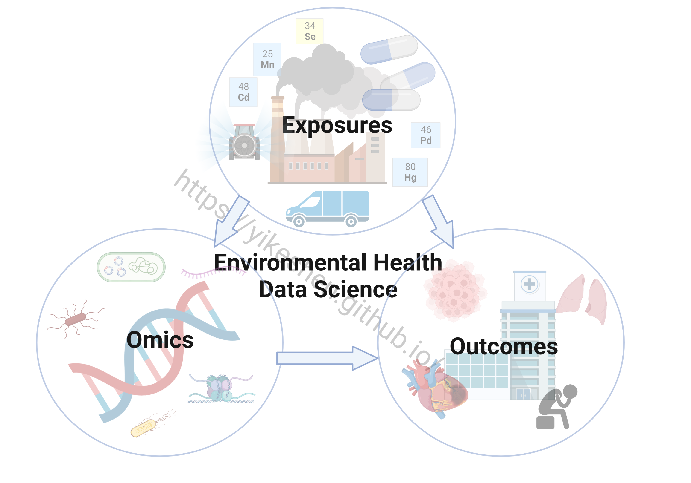
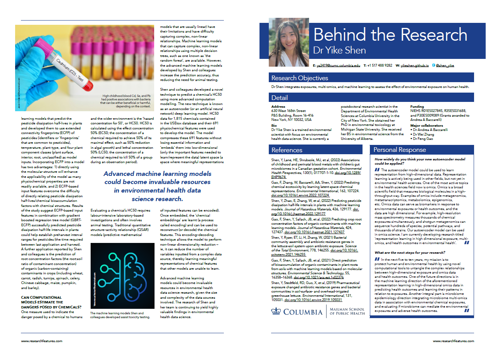

Welcome to my website! My research focuses on Environmental Health Data Science where I integrate environmental exposures, multi-omics, and health outcomes. The future Shen Laboratory will approach this framework through computational precision environmental health and biomarker discovery from high dimensional omics and environmental exposure data. My research has two directions: 

## 1. Linking environmental exposures and microbiome

Humans are exposed to a myriad of environmental pollutants (e.g., pharmaceuticals and personal care products, metals, PFAS, flame retardants, etc.) every day. Individual or mixture of pollutants may relate to changes in human gut microbiome and/or soil-plant microbiome, and subsequently impact human health. I have studied the associations of metal exposures with human gut microbiomes [Shen et al., 2022. Environmental Health Perspectives](https://doi.org/10.1289/EHP9674); antimicrobial resistance and bacterial microbiome in lettuce-soil systems [Shen et al., 2019. Environment International](https://doi.org/10.1016/j.envint.2019.105031); [Shen et al., 2021. Science of the Total Environment](https://doi.org/10.1016/j.scitotenv.2021.146255); associations of caffeine/acetaminophen with human gut microbiome [Laue and Shen et al., 2022. IJERPH](https://www.mdpi.com/1660-4601/19/15/9357/htm). Future works include associations of flame retardants/replacements and PFAS exposures with gut microbiome. Dedicated to end-to-end microbiome research, I have explored bacterial RNA quality and shotgun metatranscriptome sequencing [Shen et al., manuscript in prepration]() and streamlined microbiome bioinformatics (i.e., amplicon sequencing, shotgun metagenome sequencing, and shotgun metatranscriptome sequencing) ([Bioinformatics Collaboration](https://yikeshen.github.io//markdown/)). Additional microbiome related papers: [Shen et al., 2021. Chemosphere](https://doi.org/10.1016/j.chemosphere.2020.127677) and [Campana et al., 2022. Environmental Pollution](https://doi.org/10.1016/j.envpol.2022.120380). 

## 2. Precision computational environmental health 

##### This section employ various novel machine learning and deep learning models to tackle environmental health problems. The work from this section is the major collaboration with my colleague Dr. Feng Gao.

### Exposure assessment and toxicity
Accurate prediction of fate and transport of contaminants in the environment is a critical step in chemical risk assessment.I am interested in systematically predicting toxicity and understanding properties of interest using novel machine learning and deep learning models. Our work includes: 1) predict pesticide dissipation half-life intervals in plants using molecular fingerprints [Shen et al., 2022. Journal of Hazardous Materials](https://doi.org/10.1016/j.jhazmat.2022.129177); 2) predict chemical ecotoxicity by learning latent space chemical representations [Gao, ......, Shen*. 2022. Environment International](https://doi.org/10.1016/j.envint.2022.107224). 3) predict bioaccumulation of organic contaminants in plant roots from soils [Gao and Shen et al., 2022. Journal of Hazardous Materials](https://doi.org/10.1016/j.jhazmat.2021.127437); [Gao et al., 2021. Environmental Science & Technology](https://doi.org/10.1021/acs.est.1c02376); 

### Moleculear biomarkers and health outcomes
High dimensional data are becoming increasingly common in environmental and biomedical research (e.g., omics). While we obtain much more information from high-dimensional data, they may contain redundant information. Therefore, the ability to learn from high-dimensional data is challenging. We developed a deep learning autoencoder survival analysis model – AESurv to assist accurate early prediction of coronary heart disease from high dimensional epigenomics data [Shen et al., manuscript in prepration](). Future works include integrating metagenomics, metatranscriptomics, exposomics, etc. 

### Knowledge-driven discovery
Contemporary environmental health sciences draw on large-scale longitudinal studies to understand the impact of environmental exposures and lifestyle factors on the risk of disease and identify potential underlying mechanisms. In such studies, cohorts of individuals are assembled and followed up over time. Each cohort generates hundreds of publications, which are typically not coherently organized nor summarized, hence limiting knowledge-driven dissemination. Hence, we developed Cohort Network, a multi-layer knowledge graph approach to extract exposures, outcomes, and their connections. Exciting updates are coming soon [Shen et al., manuscript under review](). Stay tuned!

I support open and transparent research, all code for my publications (leading and/or corresponding authors) are available at my [GitHub Repository](https://github.com/YikeShen?tab=repositories); \
list of my [publications](https://scholar.google.com/citations?hl=en&user=hLvLhVcAAAAJ&view_op=list_works&sortby=pubdate);\
list of my [talks](https://yikeshen.github.io//talks/);\
my [CV](https://github.com/YikeShen/Shen-Yike_CV/blob/master/CV_Shen%2CYike_112722.pdf)

## News
Feature article about my research\
Shen Y. (2022). Harnessing high-dimensional data in environmental health sciences. Research Features. DOI: 10.26904/RF-144-3452044615. [Feature article link]( https://researchfeatures.com/wp-content/uploads/2022/11/Yike-Shen.pdf)

Contact Information
=====
Yike Shen \
Department of Environmental Health Sciences \
Columbia University Mailman School of Public Health \
630 West 168th Street \
P&S Building, Room 16-416 \
New York, New York 10032\
Email: [yike.shen@columbia.edu](yike.shen@columbia.edu)\
Email: [ys3419@cumc.columbia.edu](ys3419@cumc.columbia.edu)

Updated 12/18/2022

