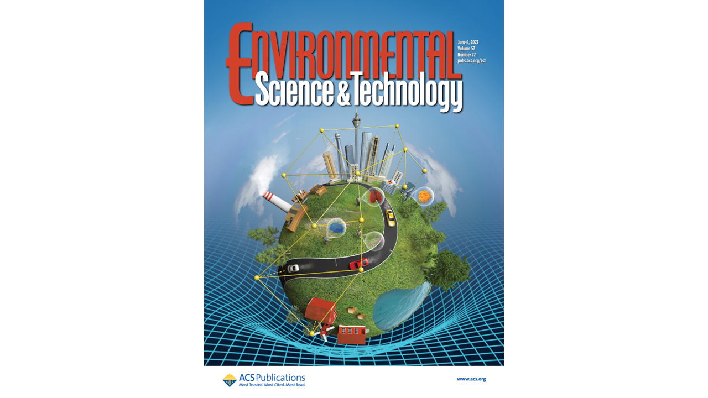

The Shen Laboratory focuses on Environmental Health Data Science where we integrate environmental exposures, multi-omics, and health outcomes. We approach this framework through computational precision environmental health and biomarker discovery from high dimensional omics and environmental exposure data.

[Dr. Shen UTA Faculty profile](https://www.uta.edu/academics/faculty/profile?username=sheny4)\
[Dr. Shen CV](https://github.com/YikeShen/Shen-Yike_CV/blob/master/CV_Shen%2CYike_02072024.pdf)

## News
- December 2023, Dr. Shen received 100%, 5/5 course evaluation for Fall 23 ENVR 4199 Seminars in Earth and Environmental Sciences Course. 
- Fall 2023, Dr. Shen gave invited lectures at Icahn School of Medicine at Mount Sinai in NYC and Baylor University in Waco, TX. 
- December 2023, Dr. Shen received Doctoral Recruiting Grant from The University of Texas at Arlington Graduate School, a grant for six prospective Ph.D. student on campus visits. 
- October 2023, Dr. Shen gave an invited lecture on Academic Interviewing and Negotiation at Columbia University. 
- September 2023, Dr. Shen recevied The University of Texas System Rising STARs award, a $100,000 competitive internal funding to help build #ShenLab. 
- September 2023, The Shen Laboratory opens at the Department of Earth and Environmental Sciences, University of Texas at Arlington
- May 2023, Our Cohort Network paper was published as Cover at Environmental Science & Technology! [Read](https://pubs.acs.org/doi/abs/10.1021/acs.est.2c08174)

- Spring 2023, Shen Laboratory website launched. [research](https://yikeshen.github.io//research/); [publications](https://scholar.google.com/citations?hl=en&user=hLvLhVcAAAAJ&view_op=list_works&sortby=pubdate); [talks](https://yikeshen.github.io//talks/); [teaching](https://yikeshen.github.io//teaching/); [join us](https://yikeshen.github.io//JoinShenLab/)
- Fall 2022-Spring 2023, Dr. Shen gave invited lectures at University of Texas at Arlington, Texas A&M University-College Station, University of California, Riverside, and University of Kentucky.  
- December 2022, Dr. Shen was featured in article "Harnessing high-dimensional data in environmental health sciences" Research Features. DOI: 10.26904/RF-144-3452044615. [Feature article link](https://researchfeatures.com/wp-content/uploads/2022/11/Yike-Shen.pdf)
- December 2022, Dr. Shen was interviewed by UCLA GradSWE "Women in Science: we have the power to change the world" interview series hosted by Yifan Gao. Episode 6 – Yike Shen. [Interview link](https://www.youtube.com/watch?v=W0Nmf7P1KAM&ab_channel=GradSWEUCLA)

## Resources
We support open and transparent research, all code for our publications (leading and/or corresponding authors) are available at our [GitHub Repository](https://github.com/YikeShen?tab=repositories); \
list of our [publications](https://scholar.google.com/citations?hl=en&user=hLvLhVcAAAAJ&view_op=list_works&sortby=pubdate);\
list of Dr. Shen's [talks](https://yikeshen.github.io//talks/)

## Contact Information
Yike Shen, Ph.D. \
Assistant Professor \
Department of Earth and Environmental Sciences \
University of Texas at Arlington \
500 Yates Street, Room 217 \
Arlington, Texas 76019\
Email: [yike.shen@uta.edu](yike.shen@uta.edu)

#### Please forward your emails to my UTA email address. My Columbia email address is now deactivated. 
Updated 12/21/2023

