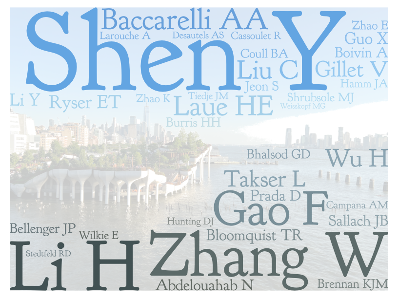



[View pdf CV here](https://github.com/YikeShen/Shen-Yike_CV/blob/master/CV_Shen%2CYike_04062023.pdf)

Education
======
* Ph.D. Crop and Soil Science – Environmental Toxicology, Michigan State University, 2020
* Ph.D. dual major, Environmental Science and Policy, Michigan State University, 2020
* B.Sc. Environmental and Conservation Sciences, University of Alberta, 2016

Interests
======

* Environmental health data science
* Microbiome
* Machine learning
* High dimensional data analysis
* Bioinformatics
* Multi-omics
* Environmental exposures

Work experience
======
* 2020.6-present: Postdoctoral Research Scientist
  * Department of Environmental Health Sciences, Columbia University
  * Mentor: Andrea Baccarelli, MD, Ph.D.

* 2016.8-2020.5: Graduate Research Assistant
  * Department of Plant, Soil, and Microbial Sciences, Michigan State University
  * Advisor, mentor: Wei Zhang, Ph.D.
  * Committe Members: Drs. Hui Li, Elliot T. Ryser, Ashley Shade

* 2016.8-2020.5: Environmental Science and Policy Fellow
  * Environmental Science and Policy Program, Michigan State University

* 2015.6-2016.2: Student Research Assistant, University of Alberta
  * Department of Renewable Resources
  * Mentors: Drs. Scott Chang & Bin Ma

Skills
======
* Programming
  * R, Python, Unix, Shell Scripts, High-Performance Computing, Amazon Web Service, GitHub

* Data analysis
  *  Microbiome bioinformatics (amplicon, shotgun metagenome, shotgun metatranscriptome), Machine learning, Big data analytics, Data visualization

* Wet Lab
  * Various molecular biology and analytical chemistry hands on laboratory skills

Coauthor word cloud as of 12/18/22

Publications
======
  <ul>
    
  </ul>
  
Talks
======
  <ul>
    
  </ul>
  
Teaching Assistant (TA)
======
* SHARP Python Boot Camp, Columbia University, Summer 2021
* SHARP Epigenetics Boot Camp, Columbia University, Summer 2020
* CSS 340: Applied Soil Physics, Michigan State University, Spring 2018 and Spring 2019
* CSS 330: Soil Chemistry, Michigan State University, Spring 2019
* RenR 299: Environmental and Forestry Spring Field School, University of Alberta, Spring 2015

Review Services
=====
* Environmental Science & Technology (ACS)
* ACS Environmental Science & Technology Water (ACS)
* Chemical Research in Toxicology (ACS)
* The Innovation (CellPress)
* Environmental Research (Elsevier)
* Science of the Total Environment (Elsevier)
* Environmental Pollution (Elsevier)
* Chemosphere (Elsevier)
* Applied Soil Ecology (Elsevier)
* Food Chemistry (Elsevier)
* Current Research in Food Science (Elsevier)
* Journal of Environmental Management (Elsevier)
* BMC Medicine (BioMed Central)
* BMC Genomics (BioMed Central)
* Frontiers in Microbiology (Frontiers)
* Current Environmental Health Reports (Springer Nature)
* Reviews of Environmental Contamination and Toxicology (Springer Nature)
* Scientific Reports (Springer Nature) 
* Journal of Trust Research (Taylor & Francis Online)
* International Journal of Environmental Research and Public Health (MDPI)
* Pathogens (MDPI)
* Nutrients (MDPI)
* Microorganisms (MDPI)

Honors & Awards
=====
Awards from Michigan State University: 
* Graduate Research Assistantship, 2016 – 2020
* Institute for Integrative Toxicology Summer Travel Award, 2017 – 2020
* Dissertation Completion Fellowship, 2019
* Graduate School Travel Funds, 2019
* College of Agriculture and Natural Resources Food Systems Fellowship, 2019
* Environmental Science and Policy Program Travel Grant, 2017,2019
* Environmental Science and Policy Doctoral Recruitment Fellowship, 2016
External Awards
* ASM Travel Grant (American Society for Microbiology), 2017
* First Class Standing (University of Alberta), 2015, 2016
* Undergraduate Research Grant (Natural Science and Engineering Research Council of Canada - CREATE Grant), 2015
* ALES Student Engagement Fund (University of Alberta), 2015
* ZAFU - UofA (ALES) Award  (University of Alberta), 2013
* National Scholarship of China (Ministry of Education in China), 2013

*Updated 04/06/2023

