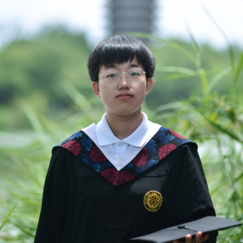

### Xu Gao, Ph.D.
Assistant Professor \
Department of Occupational and Environmental Health Sciences \
School of Public Health, Peking University \
Email: <xu.gao@pku.edu.cn> \
CV: [Xu Gao.pdf](https://github.com/gearpku2020/gearpku2020.github.io/blob/main/CV/CV%20-%20Xu%20Gao.pdf)

**Education**: 
* 2018 - 2020 Postdoctoral Researcher (Environmental Health), Columbia University (United States)
* 2014 - 2018 Ph.D. (Epidemiology, with highest honors summa cum laude), Heidelberg University (Germany)
* 2011 - 2014 Master's degree (Pathogenic Biology), Fudan University (China)
* 2006 - 2011 Bachelor's degree (Preventive Medicine), Fudan University (China)

## Students

 |  | 

Meijie Jiang
 | 
Shuzhen Liu
 | 
Haocan Song

 |  | ...

Sifan Tian
 | 
Yuting Wang
 | ...

